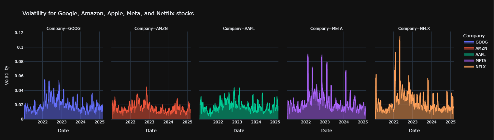
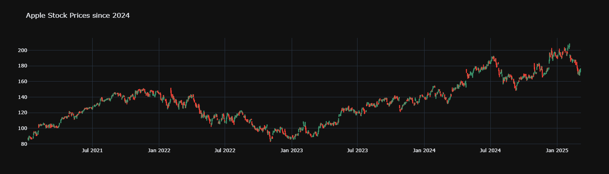
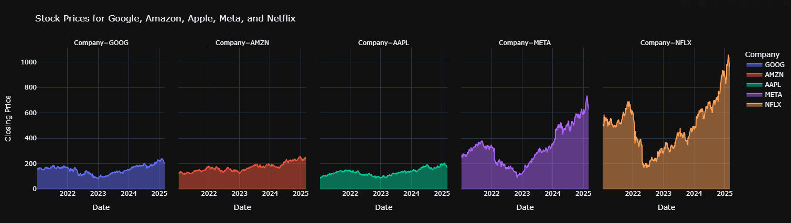
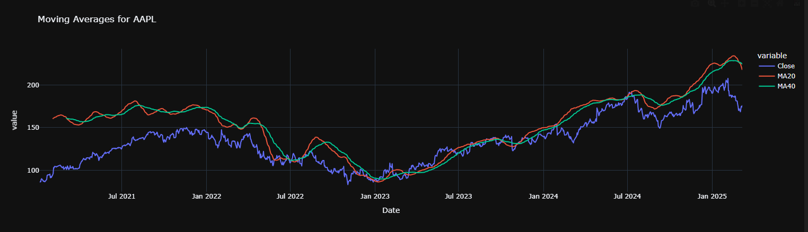
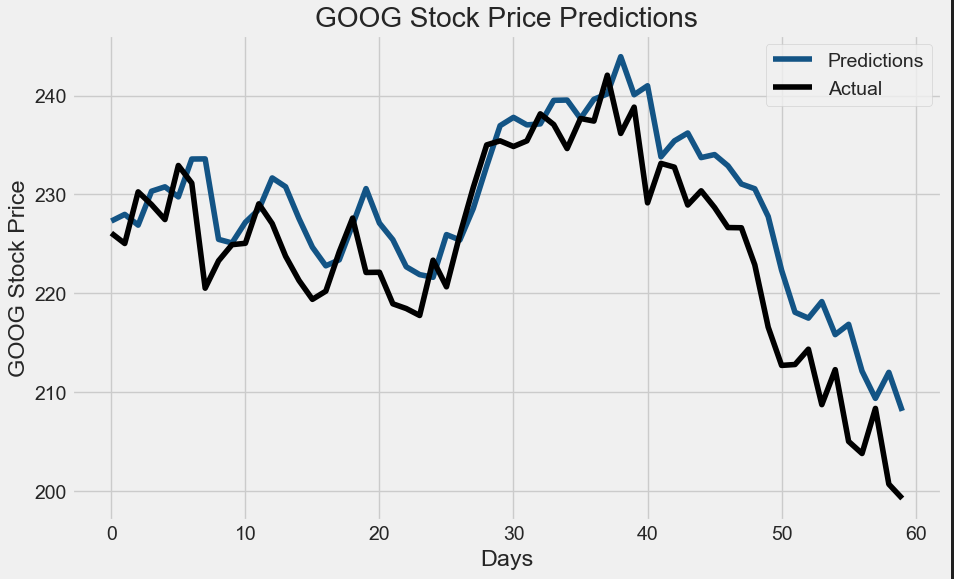

# Stock Price Prediction Using LSTM

## Project Overview

This project leverages Long Short-Term Memory (LSTM) neural networks to predict stock prices using historical market data. It is designed to deliver forward-looking insights that support data-driven investment decisions, risk management, and strategic planning.

By combining deep learning models with clear visual storytelling, this solution provides an intuitive yet powerful framework for identifying market trends. It offers practical value to financial analysts, investment teams, and business leaders aiming to enhance forecasting precision in dynamic markets.

---

## Visual Summary of Results

### Area Chart

  
This visualization shows the broader stock price trend over time, with shaded areas highlighting fluctuations and trajectory. It provides a contextual overview of market behavior, helping users quickly identify long-term movements.

---

### Candlestick Chart

  
A traditional financial chart representing daily open, high, low, and close prices. It captures market volatility and trading patterns, offering insight into price action and investor sentiment.

---

### Faceted Area Plot

  
This chart breaks down the stock’s time series data into segments for granular analysis. It enables better interpretation of trends by zooming into different time intervals.

---

### Line Chart with Moving Averages

  
Overlays predicted stock prices with short- and long-term moving averages, helping to identify potential inflection points, smoothing out noise, and providing momentum cues.

---

### Actual vs Predicted Line Chart

  
This core performance visualization compares actual historical prices with the model’s predictions. It serves as a direct evaluation of model effectiveness and alignment with real-world data.

---

## Business Value & Strategic Applications

| Business Function         | Value Proposition                                                                 |
|---------------------------|-----------------------------------------------------------------------------------|
| Executive Strategy        | Enhances planning with predictive insights on market direction.                  |
| Finance & Investment      | Supports entry/exit timing and risk assessment using quantitative forecasting.   |
| Sales & Client Advisory   | Strengthens client discussions with data-backed market perspectives.             |
| Data & Analytics Teams    | Demonstrates scalable use of deep learning in high-impact business domains.      |

By integrating this predictive model into decision-making processes, organizations can make more informed, agile, and confident financial choices.

---

## Key Features

### Model Architecture & Workflow

| Step                  | Description                                                                           |
|-----------------------|---------------------------------------------------------------------------------------|
| Data Preparation      | Cleaned, scaled, and structured historical stock data for modeling.                  |
| Model Design          | Built an LSTM neural network optimized for sequential time series forecasting.       |
| Training & Validation | Split the data for training/testing and validated with metrics such as RMSE.         |
| Forecasting Output    | Produced interpretable price predictions mapped visually against actual data.        |

---

### Visual Analytics

Visual tools were developed to make complex trends and relationships understandable to business teams:

- **Actual vs Predicted Comparisons** – for accuracy assessment.
- **Trend Smoothing via Moving Averages** – for momentum-based analysis.
- **Segmented Views** – to uncover hidden short-term trends.

---

## Tools & Technologies

- **Data Handling**: Pandas, NumPy

- **Visualization**: Matplotlib, Seaborn

- **Machine Learning**: TensorFlow, Keras

- **Development Environment**: Jupyter Notebook

---

## Insights & Recommendations

| Insight                   | Business Implication                                                                   |
|---------------------------|-----------------------------------------------------------------------------------------|
| Accurate Trend Detection  | Supports more confident investment timing and asset allocation.                        |
| Volatility Sensitivity    | Use cautiously during high-uncertainty periods; combine with other indicators.         |
| Scalability               | The model structure can be extended to multiple stocks, ETFs, or macroeconomic indices.|
| Further Improvement       | Adding features like volume, sentiment, or technical indicators could enhance predictive strength. |

---

## Contact

For implementation inquiries, strategic partnerships, or technical discussions, please connect via [LinkedIn – Vedant Shinde](https://www.linkedin.com/in/vedantshinde25).
